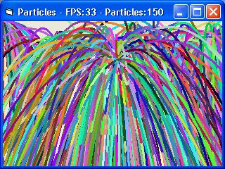



## Fast Particle Example

### Description

This is a pretty fast particle example i think. 30 fps is reallly fast, you have to download it and see it for yourself. I made it easy to edit setting to create differnt effects, just look in form_load. It will give you some tips and allow you to change wind, gravity, strength, to refresh or not, and how many particles. Enjoy, vote or comment please.
 
### More Info
 

             |
---                |---
**Submitted On**   |2005-09-25 12:43:52
**By**             |[x sAGE x](https://github.com/Planet-Source-Code/PSCIndex/blob/master/ByAuthor/x-sage-x.md)
**Level**          |Intermediate
**User Rating**    |5.0 (10 globes from 2 users)
**Compatibility**  |VB 6\.0
**Category**       |[Graphics](https://github.com/Planet-Source-Code/PSCIndex/blob/master/ByCategory/graphics__1-46.md)
**World**          |[Visual Basic](https://github.com/Planet-Source-Code/PSCIndex/blob/master/ByWorld/visual-basic.md)
**Archive File**   |[Fast\_Parti1935419252005\.zip](https://github.com/Planet-Source-Code/x-sage-x-fast-particle-example__1-62683/archive/master.zip)

